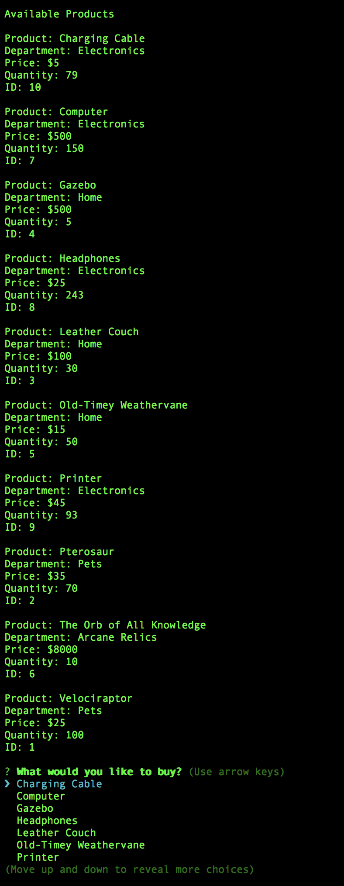
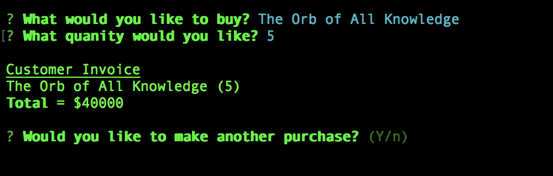
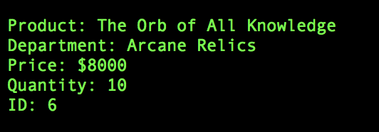
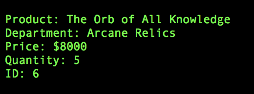
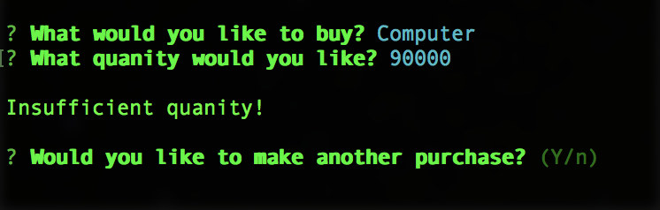

# Bamazon - _A basic node storefront_

The customer is first shown a list of all product information:

After choosing a product and quantity to purchase, the customer is invoiced and may make another purchase:

Product before purchase:  

Product after purchase:  

The customer will be notified if they attempt to purchase a quantity of product that exceeds the available stock:

